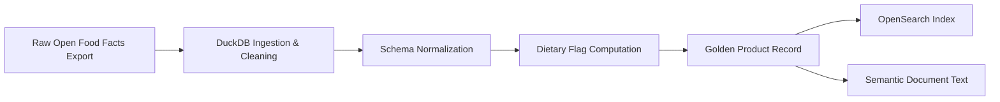
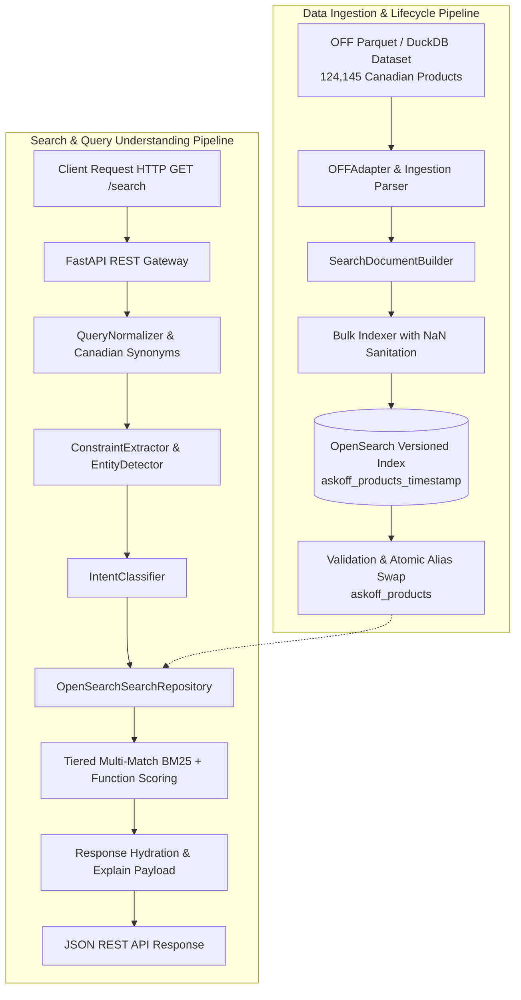

<div align="center">

# Ask-OFF Canada

### Intelligent Food Retrieval & Search Infrastructure for Open Food Facts Canada

A high-performance backend search engine focused on natural language query understanding, structured nutrition filtering, and deterministic food discovery across **124,145 Canadian Open Food Facts products**.

---


</div>

---

# Overview

**Ask-OFF Canada** is an open-source natural language search and retrieval backend engine engineered for the **Open Food Facts Canada** ecosystem.

Consumer grocery queries are inherently conversational and constraint-heavy (e.g. *"250 g tomato sauce"*, *"zero sugar chocolate"*, *"drinks under 300 calories"*, *"vegan high protein snacks"*). Standard keyword search engines often fail on these multi-dimensional queries.

Ask-OFF bridges the gap between unstructured consumer language and structured nutritional data by combining a **deterministic query-understanding pipeline** with an **OpenSearch 2.x BM25 retrieval engine**, delivering sub-50ms query execution with zero runtime LLM dependencies.

### Primary Objectives

- **Intelligent Natural Language Parsing**: Decouple recipe quantities, brand phrases, dietary flags, and nutrient thresholds from core product keywords.
- **Strict Nutritional Constraints**: Hard numeric filtering for calories, protein, sugar, sodium, and fat with Canadian regulatory compliance.
- **Golden Product Records**: Clean, unified product representations built from normalized Open Food Facts data.
- **Transparent Search Explainability**: Full visibility into why each product ranked, matching terms, and applied constraints.
- **Plugin-Ready Architecture**: Modular extensibility for fitness modes, recipe planners, allergy advisors, and brand analytics.

---

# Vision & Golden Product Records

Traditional food databases frequently suffer from inconsistent schemas, multilingual fragmentation, and noisy text fields.

Ask-OFF unifies raw Open Food Facts records into **Golden Product Records** during ingestion — standardized, deduplicated documents optimized for both full-text retrieval and analytical querying.



### Golden Record Components

- **Normalized Identity**: Cleaned product titles, brands, categories, and Canadian barcode paths.
- **Multilingual Consolidation**: Prioritized English/French text resolution with graceful fallback.
- **Standardized Nutriments**: Per-100g and per-serving macro/micronutrient fields validated against physical limits.
- **Precomputed Health Flags**: Automated computation of `is_organic`, `is_vegan`, `is_vegetarian`, `is_low_sugar`, `is_high_protein`, and `is_palm_oil_free`.
- **Structured Semantic Documents**: Text-rich representations for context-aware search and future dense vector experiments.

---

# Architecture



---

# Technology Stack

| Layer | Technologies | Purpose |
|---|---|---|
| **Backend API** | Python 3.11+, FastAPI, Pydantic v2, Uvicorn | High-throughput, low-latency REST API with OpenAPI documentation |
| **Search Engine** | OpenSearch 2.12+ | Tiered BM25 lexical retrieval, edge-ngram autocomplete, custom synonym analyzers |
| **Data Engine** | DuckDB, PyArrow, Parquet | High-performance streaming ingestion, schema introspection, and data verification |
| **Deployment** | Docker, Docker Compose, Multi-stage builds | Containerized, non-root (`UID: 10001`) reproducible environments |
| **Code Quality** | Pytest (148 tests), Ruff linter | Strict regression testing, type safety, and automated quality checks |

---

# Search & Retrieval Architecture

The retrieval system uses a **hybrid multi-tier ranking strategy** designed to ensure that exact matches dominate, while maintaining typo resilience and strict constraint enforcement.

```
                    ┌─────────────────────────────────────────────────────────┐
                    │                   Incoming Search Query                 │
                    └────────────────────────────┬────────────────────────────┘
                                                 │
                                                 ▼
                    ┌─────────────────────────────────────────────────────────┐
                    │              Tiered Multi-Match BM25                   │
                    ├─────────────────────────────────────────────────────────┤
                    │ 1. Phrase Match (Boost: 10.0)                           │
                    │    product_name^3.0, brand^2.0, category^1.5, ...       │
                    │                                                         │
                    │ 2. AND Match (Boost: 5.0)                               │
                    │    Requires all terms across search fields               │
                    │                                                         │
                    │ 3. Fuzzy AUTO Match (Boost: 0.5)                        │
                    │    Levenshtein distance 1-2 with tiered min-should-match │
                    └────────────────────────────┬────────────────────────────┘
                                                 │
                                                 ▼
                    ┌─────────────────────────────────────────────────────────┐
                    │              Structured Function Scoring                │
                    ├─────────────────────────────────────────────────────────┤
                    │ Score = BM25_Score + (metadata.completeness * 0.15)     │
                    │ + Hard Numeric Nutrient Filters (sugars, kcal, protein) │
                    └─────────────────────────────────────────────────────────┘
```

### Search Capabilities & Query Understanding

| Capability | Example Query | Extracted Term | Applied Constraint / Behavior |
|---|---|---|---|
| **Recipe Quantity** | `250 g tomato sauce` | `tomato sauce` | Isolates `quantity: 250 g` without polluting lexical query |
| **Zero Sugar** | `zero sugar chocolate` | `chocolate` | Enforces hard filter `sugars <= 0.5g / 100g` (Canadian standard) |
| **Low Sugar** | `low sugar cereal` | `cereal` | Enforces boolean flag `is_low_sugar: true` (`sugars <= 5.0g / 100g`) |
| **Numeric Calorie Bound** | `drinks under 300 calories` | `drinks` | Enforces numeric filter `energy-kcal <= 300` |
| **Numeric Protein Bound** | `snacks with at least 20g protein` | `snacks` | Enforces numeric filter `proteins >= 20.0g / 100g` |
| **Directional Sorting** | `lowest sugar chocolate` | `chocolate` | Sorts results ascending by `sugars.per_100g` |
| **Dietary Restriction** | `vegan high protein snacks` | `snacks` | Filters `is_vegan: true` and `is_high_protein: true` |
| **Store Brand Discovery** | `Compliments peanut butter` | `peanut butter` | Detects brand entity and promotes to filter `{brand: Compliments}` |
| **Typo Resilience** | `high protien snacks` | `snacks` | Corrects `protien` $\to$ `protein` via normalization |
| **Bilingual Synonyms** | `kraft dinner` | `kraft dinner` | Matches `macaroni and cheese` via Canadian bilingual synonym engine |

---

# Semantic Product Documents

In addition to structured fields, products are transformed into readable **Semantic Product Documents** during ingestion. This enables richer context-aware full-text search and provides the foundation for future dense vector embeddings and retrieval-augmented workflows.

```yaml
Product: President's Choice Organic Smooth Peanut Butter
Brand: President's Choice
Categories: Plant-based foods, Spreads, Nut butters, Peanut butters

Ingredients:
  - 100% Organic dry roasted peanuts

Nutrition (per 100g):
  Calories: 580 kcal
  Protein: 26.0 g
  Sugars: 3.0 g
  Fat: 50.0 g
  Sodium: 0.0 mg

Health & Dietary Flags:
  Organic: Yes
  Vegan: Yes
  Gluten Free: Yes
  Low Sugar: Yes (<= 5.0g)
  Palm Oil Free: Yes
  Nutri-Score: A
  NOVA Group: 1 (Unprocessed)
```

---

# REST API Endpoints

The FastAPI backend exposes clean, fully documented REST endpoints:

| Endpoint | Method | Description | Example Query |
|---|---|---|---|
| `/search` | `GET` | Natural language search with query explainability | `/search?q=zero+sugar+chocolate&explain=true` |
| `/product/{id}` | `GET` | Retrieve full product document by barcode | `/product/0068100084124` |
| `/autocomplete` | `GET` | Sub-millisecond edge-ngram prefix search | `/autocomplete?q=choc` |
| `/compare` | `POST` | Multi-product nutritional comparison matrix | `POST /compare` with `{"product_ids": [...]}` |
| `/health` | `GET` | Service liveness health check | `/health` |
| `/ready` | `GET` | Cluster readiness and OpenSearch index check | `/ready` |

Interactive Swagger documentation is available at `http://localhost:8000/docs`.

---

# Dataset Facts

Ask-OFF is fully integrated with the Canadian Open Food Facts dataset:

- **Source File**: `data/raw/off_canada_with_images.parquet`
- **Total Products**: **124,145 Canadian food products**
- **Unique Barcodes**: **124,145** (0 duplicate barcodes)
- **Product Images**: **99,459 products** with valid Open Food Facts CDN URLs (~80.12%)
- **Nutritional Data**: **113,459 products** with structured nutrition payloads (~91.39%)
- **Active OpenSearch Alias**: `askoff_products`

---

# Contributor Quick Start

A new contributor can set up and run AskOFF-Search locally following this sequential workflow:

```text
Clone
  ↓
Install dependencies
  ↓
Prepare dataset
  ↓
Start OpenSearch
  ↓
Create/populate index
  ↓
Start FastAPI
  ↓
Test /health
  ↓
Run normal search
  ↓
Run tests
```

---

### Step 1: Code-Only Setup (Install Dependencies)

Clone the repository and set up a Python virtual environment:

```bash
# Clone the repository
git clone https://github.com/offCanada/AskOFF-Search.git
cd AskOFF-Search

# Create Python 3.11 virtual environment
python3.11 -m venv .venv

# Activate virtual environment
# On macOS/Linux:
source .venv/bin/activate
# On Windows:
.venv\Scripts\activate

# Upgrade pip and install application dependencies
python -m pip install --upgrade pip
pip install -r backend/requirements.txt
pip install pytest ruff
```

> [!NOTE]
> Installing Python dependencies provides the runtime libraries, but does **not** download or bundle the Canadian food catalog dataset.

---

### Step 2: Data Setup (Acquire Parquet Dataset)

The canonical food catalog contains **124,145 Canadian products** and is **not committed to Git** due to file size constraints (~21.8 MB to ~48.9 MB).

The backend indexing scripts expect a normalized Parquet dataset at:
- `data/raw/off_canada_with_images.parquet` or
- `data/raw/normalized.parquet`

The repository currently does not automatically download the generated Canadian Parquet artifact. Before index bootstrap, obtain or generate a compatible dataset and place it at the path expected by the indexing scripts.

#### Official Published Dataset Resources
- **Hugging Face Dataset**: [`offCanada/openfoodfacts-canada`](https://huggingface.co/datasets/offCanada/openfoodfacts-canada)
- **Google Colab Generation Notebook**: [`OFF_Canada_Data_Code.ipynb`](https://huggingface.co/datasets/offCanada/openfoodfacts-canada/blob/main/OFF_Canada_Data_Code.ipynb)
- **Kaggle Dataset**: [`saitejakommi/open-food-facts-canada-dataset`](https://www.kaggle.com/datasets/saitejakommi/open-food-facts-canada-dataset)

Place the downloaded or generated Parquet file in the `data/raw/` directory:
```bash
mkdir -p data/raw
# Ensure data/raw/off_canada_with_images.parquet or data/raw/normalized.parquet exists
```

---

### Step 3: Infrastructure Setup (Start OpenSearch)

AskOFF uses OpenSearch 2.12+ for lexical retrieval.

#### The Docker External Volume Requirement
In `docker-compose.yml`, the OpenSearch container data volume is declared as an external volume:
```yaml
volumes:
  askoff-os-data:
    name: ask-off-webapp_askoff-os-data
    external: true
```
On a clean machine where the volume has not been created, running `docker compose up -d opensearch` will encounter:
```text
external volume "ask-off-webapp_askoff-os-data" not found
```

#### Verified Temporary Workaround
Pre-create the external volume manually before starting the container:
```bash
# 1. Create the volume
docker volume create ask-off-webapp_askoff-os-data

# 2. Start OpenSearch container
docker compose up -d opensearch

# 3. Verify OpenSearch is responsive
curl http://localhost:9200
```

> [!WARNING]
> This manual volume creation is a **TEMPORARY WORKAROUND ONLY** and not the ideal final architecture. Future configuration updates should remove the requirement for clean developer machines to depend on a pre-existing external Docker volume.

---

### Step 4: Runtime Setup (Bootstrap Index & Run Server)

Once OpenSearch is running and the Parquet dataset is in `data/raw/`:

```bash
# 1. Bootstrap the OpenSearch index from the Parquet dataset
python backend/scripts/bootstrap_index.py

# 2. Verify indexed document count and cluster health
python backend/scripts/verify_index.py
```

Expected verification output:
```text
OpenSearch Host:              localhost:9200
OpenSearch Cluster Health:    yellow or green
OpenSearch Index Name:        askoff_products
Indexed Document Count:       124,145
Status:                       CANONICAL 114K VERIFIED
```

#### Start FastAPI Server
```bash
python backend/scripts/run_server.py
# or: uvicorn backend.api.app:app --reload --port 8000
```
The API is available at `http://127.0.0.1:8000`. Interactive Swagger UI is accessible at `http://127.0.0.1:8000/docs`.

---

# End-to-End Contributor Verification

After completing setup, verify the entire stack with live queries:

### 1. Check OpenSearch Health
```bash
curl http://localhost:9200
```

### 2. Check API Health
```bash
curl http://127.0.0.1:8000/health
# Response: {"status":"healthy"}
```

### 3. Run Normal Lexical Searches
Test standard keyword queries to ensure products are retrieved:
```bash
# Search for milk
curl "http://127.0.0.1:8000/search?q=milk&size=3"

# Search for bread
curl "http://127.0.0.1:8000/search?q=bread&size=3"

# Search for chocolate
curl "http://127.0.0.1:8000/search?q=chocolate&size=3"

# Search for peanut butter
curl "http://127.0.0.1:8000/search?q=peanut+butter&size=3"
```

> [!IMPORTANT]
> **Hit Count Verification**:
> HTTP 200 with 0 hits (`"products": []`) indicates that the FastAPI application is alive, but the underlying OpenSearch product index is **empty** or unpopulated.
> A successful search must return actual product documents with non-empty product names and attributes.

### 4. Product Lookup by Barcode
Extract a barcode (`id` / `code`) from any returned search result and verify single-product lookup:
```bash
curl "http://127.0.0.1:8000/product/0068100084124"
```
Should return the complete golden product record with nutriments and dietary flags.

---

# Constrained & NLP Search Verification

Once normal search is verified, test AskOFF's deterministic natural language parsing and nutritional filtering:

| Search Query | Command | What Is Verified |
|---|---|---|
| **Zero Sugar** | `curl "http://127.0.0.1:8000/search?q=zero+sugar+chocolate"` | Enforces Canadian threshold (`sugars <= 0.5g/100g`) |
| **High Protein** | `curl "http://127.0.0.1:8000/search?q=high+protein+snacks"` | Filters `is_high_protein: true` (`protein >= 10g`) |
| **Vegan Dietary** | `curl "http://127.0.0.1:8000/search?q=vegan+cereal"` | Filters `is_vegan: true` |
| **Low Sugar** | `curl "http://127.0.0.1:8000/search?q=low+sugar+cereal"` | Filters `is_low_sugar: true` (`sugars <= 5.0g/100g`) |
| **Calorie Upper Bound** | `curl "http://127.0.0.1:8000/search?q=drinks+under+300+calories"` | Numeric filter `energy-kcal <= 300` |
| **Protein Lower Bound** | `curl "http://127.0.0.1:8000/search?q=snacks+with+at+least+20g+protein"` | Numeric filter `proteins >= 20.0g/100g` |

> [!NOTE]
> **Distinguishing Query Parsing from Retrieval**:
> The API returns an `applied_filters` or `explanation` block showing parsed constraints. A query where constraints parse correctly but 0 products match is **not** evidence of an algorithmic flaw if no products satisfy the combined constraints; conversely, if the index contains 0 documents, all queries will return 0 hits.

---

# Forking and Testing AskOFF-Search

When developing as an open-source contributor, you do **not** need access to maintainer-private machines, local file paths, or private Docker volumes. Follow this self-contained contributor scenario:

1. **Fork**: Click "Fork" on `https://github.com/offCanada/AskOFF-Search`.
2. **Clone**: Clone your fork (`git clone https://github.com/<your-username>/AskOFF-Search.git`).
3. **Environment**: Create `.venv` with Python 3.11 and install `backend/requirements.txt`.
4. **Volume Workaround**: Run `docker volume create ask-off-webapp_askoff-os-data`.
5. **Start Infrastructure**: Run `docker compose up -d opensearch`.
6. **Place Dataset**: Place `off_canada_with_images.parquet` or `normalized.parquet` into `data/raw/`.
7. **Populate Index**: Run `python backend/scripts/bootstrap_index.py`.
8. **Start Backend**: Run `python backend/scripts/run_server.py`.
9. **Verify**: Test `/health` and run real product searches (`curl "http://127.0.0.1:8000/search?q=milk"`).
10. **Test Suite**: Run `pytest backend/tests/` and `ruff check backend/`.

---

# Running Tests & Quality Checks

### Test Suite Reproducibility Reality

```bash
# Run backend pytest suite
pytest backend/tests/ -v

# Run static analysis (0 lint errors required)
ruff check backend/
```

- **Populated Environment with Dataset**: In the verified development environment where `data/raw/normalized.parquet` is present, all **148 tests pass** (0 failures, 0 regressions).
- **Clean Clone without Dataset**: Running `pytest backend/tests/` on a fresh clone without the Parquet dataset yields **143 passed / 5 failed** tests because 5 retrieval/pipeline tests directly read the Parquet file from disk.
- **Contributor Task**: Decoupling these 5 data-dependent tests using synthetic mock fixtures or a lightweight committed test sample is an active open-source improvement.

---

# Platform Notes

### macOS / Apple Silicon Notes
A clean-machine test was performed on macOS 26.5.2 on Apple Silicon (`arm64`) using Python 3.11.14, Docker 29.3.1, and Docker Compose v5.1.0:
- Application dependencies and FastAPI installed and ran cleanly on Apple Silicon.
- Verify your environment:
  ```bash
  python3.11 --version
  uname -m              # Expected on Apple Silicon: arm64
  docker --version
  docker compose version
  ```
- *Distinction*: The application dependencies and FastAPI service were verified on macOS Apple Silicon; full search functionality requires the external Parquet dataset and Docker volume setup described above. This is not a claim that every macOS version or architecture is universally supported.

### Linux Notes
- Standard Docker Engine with Compose plugin is supported. Ensure your user belongs to the `docker` group to run compose commands without `sudo`.

### Windows Notes
- Use PowerShell or Command Prompt. Activate virtual environment with `.venv\Scripts\activate`.

---

# Troubleshooting

### 1. OpenSearch Volume Not Found
- **Error**: `external volume "ask-off-webapp_askoff-os-data" not found`
- **Cause**: `docker-compose.yml` expects an external volume.
- **Fix**: Run `docker volume create ask-off-webapp_askoff-os-data` before launching compose.

### 2. Parquet File Not Found (`FileNotFoundError`)
- **Error**: `FileNotFoundError: Data file not found at data/raw/off_canada_with_images.parquet`
- **Cause**: Parquet artifacts are not committed to Git.
- **Fix**: Download or generate the Parquet dataset and place it at `data/raw/off_canada_with_images.parquet` or `data/raw/normalized.parquet`.

### 3. Search Returns HTTP 200 with 0 Products
- **Symptom**: `curl http://127.0.0.1:8000/search?q=milk` returns `{"products": []}`.
- **Cause**: OpenSearch is running, but the index was never populated.
- **Fix**: Verify document count with `python backend/scripts/verify_index.py`. If 0, run `python backend/scripts/bootstrap_index.py`.

### 4. Five Tests Fail with DuckDB / FileNotFoundError
- **Symptom**: `pytest backend/tests/` shows 143 passed, 5 failed.
- **Cause**: 5 tests depend directly on `data/raw/normalized.parquet`.
- **Fix**: Place the dataset in `data/raw/` to run all 148 tests, or contribute by refactoring these tests to use synthetic mock fixtures.

---

# Known Limitations

We document these technical realities honestly for all contributors:
1. **Unbundled Dataset**: The 124,145 Canadian product Parquet file is not committed to Git due to size.
2. **Manual Dataset Acquisition**: Fresh-clone dataset acquisition is not yet automated via a single CLI command.
3. **Docker External Volume**: Developer machines currently require a manual `docker volume create` step.
4. **Data-Dependent Tests**: 5 backend unit tests expect physical Parquet files on disk.
5. **Pending Cloud Hosting**: Public production cloud hosting and official domain assignment remain pending review by Open Food Facts core maintainers.

---

# Technical Documentation Index

For in-depth architectural and operational guides:
- [docs/UNDERSTAND_CODEBASE.md](docs/UNDERSTAND_CODEBASE.md) — Comprehensive technical reference, query lifecycle, BM25 scoring, and NLP pipeline.
- [docs/DEPLOYMENT.md](docs/DEPLOYMENT.md) — Container deployment, blue/green alias rotation, and production monitoring.
- [CONTRIBUTING.md](CONTRIBUTING.md) — Contributor standards, coding conventions, and PR workflows.

---

# License

This project is licensed under the [Apache 2.0 License](LICENSE). Underlyling food data is provided by [Open Food Facts](https://world.openfoodfacts.org/) under the [Open Database License (ODbL)](https://opendatacommons.org/licenses/odbl/).

---

<div align="center">

### 🌱 Building intelligent, transparent food discovery for Open Food Facts Canada.

</div>
