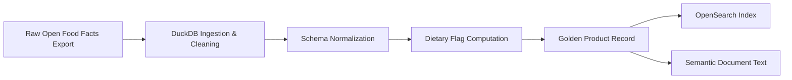
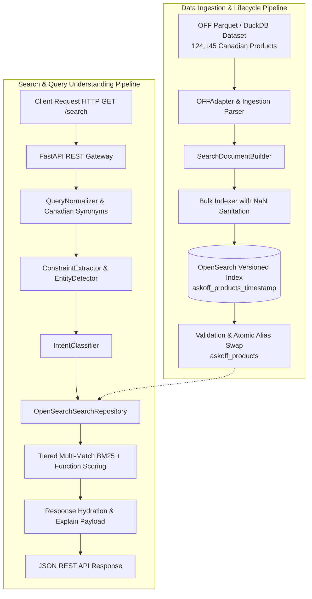

<div align="center">

# Ask-OFF Canada

### Intelligent Food Retrieval & Search Infrastructure for Open Food Facts Canada

A high-performance backend search engine focused on natural language query understanding, structured nutrition filtering, and deterministic food discovery across **124,145 Canadian Open Food Facts products**.

---


</div>

---

# Overview

**Ask-OFF Canada** is an open-source natural language search and retrieval backend engine engineered for the **Open Food Facts Canada** ecosystem.

Consumer grocery queries are inherently conversational and constraint-heavy (e.g. *"250 g tomato sauce"*, *"zero sugar chocolate"*, *"drinks under 300 calories"*, *"vegan high protein snacks"*). Standard keyword search engines often fail on these multi-dimensional queries.

Ask-OFF bridges the gap between unstructured consumer language and structured nutritional data by combining a **deterministic query-understanding pipeline** with an **OpenSearch 2.x BM25 retrieval engine**, delivering sub-50ms query execution with zero runtime LLM dependencies.

### Primary Objectives

- **Intelligent Natural Language Parsing**: Decouple recipe quantities, brand phrases, dietary flags, and nutrient thresholds from core product keywords.
- **Strict Nutritional Constraints**: Hard numeric filtering for calories, protein, sugar, sodium, and fat with Canadian regulatory compliance.
- **Golden Product Records**: Clean, unified product representations built from normalized Open Food Facts data.
- **Transparent Search Explainability**: Full visibility into why each product ranked, matching terms, and applied constraints.
- **Plugin-Ready Architecture**: Modular extensibility for fitness modes, recipe planners, allergy advisors, and brand analytics.

---

# Vision & Golden Product Records

Traditional food databases frequently suffer from inconsistent schemas, multilingual fragmentation, and noisy text fields.

Ask-OFF unifies raw Open Food Facts records into **Golden Product Records** during ingestion — standardized, deduplicated documents optimized for both full-text retrieval and analytical querying.



### Golden Record Components

- **Normalized Identity**: Cleaned product titles, brands, categories, and Canadian barcode paths.
- **Multilingual Consolidation**: Prioritized English/French text resolution with graceful fallback.
- **Standardized Nutriments**: Per-100g and per-serving macro/micronutrient fields validated against physical limits.
- **Precomputed Health Flags**: Automated computation of `is_organic`, `is_vegan`, `is_vegetarian`, `is_low_sugar`, `is_high_protein`, and `is_palm_oil_free`.
- **Structured Semantic Documents**: Text-rich representations for context-aware search and future dense vector experiments.

---

# Architecture



---

# Technology Stack

| Layer | Technologies | Purpose |
|---|---|---|
| **Backend API** | Python 3.11+, FastAPI, Pydantic v2, Uvicorn | High-throughput, low-latency REST API with OpenAPI documentation |
| **Search Engine** | OpenSearch 2.12+ | Tiered BM25 lexical retrieval, edge-ngram autocomplete, custom synonym analyzers |
| **Data Engine** | DuckDB, PyArrow, Parquet | High-performance streaming ingestion, schema introspection, and data verification |
| **Deployment** | Docker, Docker Compose, Multi-stage builds | Containerized, non-root (`UID: 10001`) reproducible environments |
| **Code Quality** | Pytest (148 tests), Ruff linter | Strict regression testing, type safety, and automated quality checks |

---

# Search & Retrieval Architecture

The retrieval system uses a **hybrid multi-tier ranking strategy** designed to ensure that exact matches dominate, while maintaining typo resilience and strict constraint enforcement.

```
                    ┌─────────────────────────────────────────────────────────┐
                    │                   Incoming Search Query                 │
                    └────────────────────────────┬────────────────────────────┘
                                                 │
                                                 ▼
                    ┌─────────────────────────────────────────────────────────┐
                    │              Tiered Multi-Match BM25                   │
                    ├─────────────────────────────────────────────────────────┤
                    │ 1. Phrase Match (Boost: 10.0)                           │
                    │    product_name^3.0, brand^2.0, category^1.5, ...       │
                    │                                                         │
                    │ 2. AND Match (Boost: 5.0)                               │
                    │    Requires all terms across search fields               │
                    │                                                         │
                    │ 3. Fuzzy AUTO Match (Boost: 0.5)                        │
                    │    Levenshtein distance 1-2 with tiered min-should-match │
                    └────────────────────────────┬────────────────────────────┘
                                                 │
                                                 ▼
                    ┌─────────────────────────────────────────────────────────┐
                    │              Structured Function Scoring                │
                    ├─────────────────────────────────────────────────────────┤
                    │ Score = BM25_Score + (metadata.completeness * 0.15)     │
                    │ + Hard Numeric Nutrient Filters (sugars, kcal, protein) │
                    └─────────────────────────────────────────────────────────┘
```

### Search Capabilities & Query Understanding

| Capability | Example Query | Extracted Term | Applied Constraint / Behavior |
|---|---|---|---|
| **Recipe Quantity** | `250 g tomato sauce` | `tomato sauce` | Isolates `quantity: 250 g` without polluting lexical query |
| **Zero Sugar** | `zero sugar chocolate` | `chocolate` | Enforces hard filter `sugars <= 0.5g / 100g` (Canadian standard) |
| **Low Sugar** | `low sugar cereal` | `cereal` | Enforces boolean flag `is_low_sugar: true` (`sugars <= 5.0g / 100g`) |
| **Numeric Calorie Bound** | `drinks under 300 calories` | `drinks` | Enforces numeric filter `energy-kcal <= 300` |
| **Numeric Protein Bound** | `snacks with at least 20g protein` | `snacks` | Enforces numeric filter `proteins >= 20.0g / 100g` |
| **Directional Sorting** | `lowest sugar chocolate` | `chocolate` | Sorts results ascending by `sugars.per_100g` |
| **Dietary Restriction** | `vegan high protein snacks` | `snacks` | Filters `is_vegan: true` and `is_high_protein: true` |
| **Store Brand Discovery** | `Compliments peanut butter` | `peanut butter` | Detects brand entity and promotes to filter `{brand: Compliments}` |
| **Typo Resilience** | `high protien snacks` | `snacks` | Corrects `protien` $\to$ `protein` via normalization |
| **Bilingual Synonyms** | `kraft dinner` | `kraft dinner` | Matches `macaroni and cheese` via Canadian bilingual synonym engine |

---

# Semantic Product Documents

In addition to structured fields, products are transformed into readable **Semantic Product Documents** during ingestion. This enables richer context-aware full-text search and provides the foundation for future dense vector embeddings and retrieval-augmented workflows.

```yaml
Product: President's Choice Organic Smooth Peanut Butter
Brand: President's Choice
Categories: Plant-based foods, Spreads, Nut butters, Peanut butters

Ingredients:
  - 100% Organic dry roasted peanuts

Nutrition (per 100g):
  Calories: 580 kcal
  Protein: 26.0 g
  Sugars: 3.0 g
  Fat: 50.0 g
  Sodium: 0.0 mg

Health & Dietary Flags:
  Organic: Yes
  Vegan: Yes
  Gluten Free: Yes
  Low Sugar: Yes (<= 5.0g)
  Palm Oil Free: Yes
  Nutri-Score: A
  NOVA Group: 1 (Unprocessed)
```

---

# REST API Endpoints

The FastAPI backend exposes clean, fully documented REST endpoints:

| Endpoint | Method | Description | Example Query |
|---|---|---|---|
| `/search` | `GET` | Natural language search with query explainability | `/search?q=zero+sugar+chocolate&explain=true` |
| `/product/{id}` | `GET` | Retrieve full product document by barcode | `/product/0068100084124` |
| `/autocomplete` | `GET` | Sub-millisecond edge-ngram prefix search | `/autocomplete?q=choc` |
| `/compare` | `POST` | Multi-product nutritional comparison matrix | `POST /compare` with `{"product_ids": [...]}` |
| `/health` | `GET` | Service liveness health check | `/health` |
| `/ready` | `GET` | Cluster readiness and OpenSearch index check | `/ready` |

Interactive Swagger documentation is available at `http://localhost:8000/docs`.

---

# Dataset Facts

Ask-OFF is fully integrated with the Canadian Open Food Facts dataset:

- **Source File**: `data/raw/off_canada_with_images.parquet`
- **Total Products**: **124,145 Canadian food products**
- **Unique Barcodes**: **124,145** (0 duplicate barcodes)
- **Product Images**: **99,459 products** with valid Open Food Facts CDN URLs (~80.12%)
- **Nutritional Data**: **113,459 products** with structured nutrition payloads (~91.39%)
- **Active OpenSearch Alias**: `askoff_products`

---

# Quick Start

### Prerequisites
- Python 3.11+
- Docker and Docker Compose v2

### Clone Repository
```bash
git clone https://github.com/offCanada/AskOFF-Search.git
cd AskOFF-Search
```

---

### Option A: Run Backend via Docker Compose (Recommended)

```bash
# Build and start OpenSearch, Ingestion, and FastAPI Backend
docker compose up --build -d


# Verify backend health
curl http://localhost:8000/health
```

---

### Option B: Local Python Development Setup

#### 1. Start OpenSearch Container
```bash
docker compose up -d opensearch
```

#### 2. Set Up Python Environment
```bash
# Create virtual environment
python -m venv .venv

# Activate environment
# On Windows:
.venv\Scripts\activate
# On Linux/macOS:
source .venv/bin/activate

# Install dependencies
pip install -r backend/requirements.txt
```

#### 3. Ingest Data & Start Server
```bash
# Verify / bootstrap OpenSearch index
python backend/scripts/verify_index.py

# Start FastAPI server
python -m uvicorn backend.main:app --reload
# or: python backend/scripts/run_server.py
```
Backend API will be available at `http://localhost:8000` (Swagger UI at `http://localhost:8000/docs`).

---

# Running Tests & Quality Checks

```bash
# 1. Run all 148 backend regression & unit tests
pytest backend/tests/ -v

# 2. Run Ruff static linter (0 errors)
ruff check backend/
```

---

# Documentation

For comprehensive technical deep-dives, architectural diagrams, and deployment guides:

- [docs/UNDERSTAND_CODEBASE.md](docs/UNDERSTAND_CODEBASE.md) — Complete codebase architecture and query execution lifecycle.
- [docs/DEPLOYMENT.md](docs/DEPLOYMENT.md) — Production deployment, blue/green index aliasing, and operational guides.
- [CONTRIBUTING.md](CONTRIBUTING.md) — Guidelines for code style, testing, and pull requests.

---

# License

This project is licensed under the [Apache 2.0 License](LICENSE).

---

<div align="center">

### 🌱 Building intelligent, transparent food discovery for Open Food Facts Canada.

</div>

